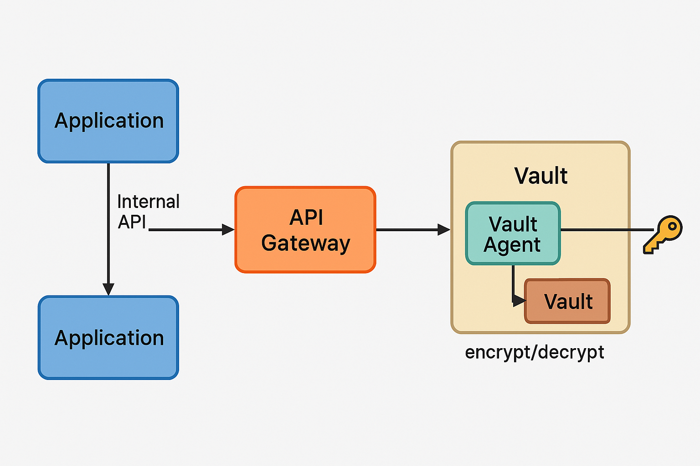

# vault-compare-ui

# vault용 앱롤 생성

vault auth enable approle

vault write auth/approle/role/vault-app-role \
 secret_id_ttl=60m \
 token_ttl=60m \
 token_max_ttl=120m \
 policies=default

vault read -field=role_id auth/approle/role/vault-app-role/role-id
vault write -f -field=secret_id auth/approle/role/vault-app-role/secret-id

kubectl create secret generic vault-approle \
 --from-literal=role-id='<ROLE_ID>' \
 --from-literal=secret-id='<NEW_SECRET_ID>'

# vault 앱롤에 폴리시 적용

vi transit-policy.hcl

```transit-policy.hcl
path "auth/approle/login" {
  capabilities = ["create", "read"]
}

path "transit/encrypt/tenant-a-key" {
  capabilities = ["update"]
}

path "transit/decrypt/tenant-a-key" {
  capabilities = ["update"]
}

path "transit/encrypt/tenant-b-key" {
  capabilities = ["update"]
}

path "transit/decrypt/tenant-b-key" {
  capabilities = ["update"]
}
```

## 정책 등록

vault policy write transit-policy ./transit-policy.hcl

## AppRole에 정책 연결

vault write auth/approle/role/vault-app-role token_policies="transit-policy"

# Vault 연동 방식 비교 및 보안 전략

## 1. Vault Agent + AppRole + File Sink 방식 (가장 일반적임)

### 구성

- Pod에 Vault Agent를 사이드카 형태로 함께 배포한다.
- Vault Agent는 AppRole로 Vault에 인증한다.
- 인증된 Token을 emptyDir에 `key.txt` 등의 이름으로 파일로 저장한다.
- 메인 애플리케이션은 해당 Token을 읽어 Vault API를 호출한다.
  - 예: `POST /v1/transit/encrypt/...`

### 장점

- Vault Token을 코드에 하드코딩하지 않아도 된다.
- Vault Agent가 Token을 자동으로 갱신한다.
- 가장 일반적이고 HashiCorp 공식 가이드에서도 권장되는 방식이다.

### 단점

- Token이 파일로 저장되기 때문에 노출 위험이 존재한다.  
  단, readOnly 마운트, 짧은 TTL, 엄격한 RBAC 등을 통해 완화할 수 있다.

---

## 2. Vault Agent Proxy 모드

### 구성

- Vault Agent를 HTTP Proxy로 구성한다 (`-listener tcp` 옵션 사용).
- 애플리케이션은 localhost의 Vault Agent 포트로 Vault API를 호출한다.
- Vault Agent는 Token을 자동으로 포함하여 Vault로 중계 요청을 수행한다.

### 장점

- 애플리케이션은 Vault Token을 몰라도 된다.
- Token이 파일에 저장되지 않는다.

### 단점

- HTTP Proxy 구성이 필요하다.
- 애플리케이션이 Vault Agent의 주소를 명시적으로 호출해야 한다.

---

## 3. 외부 API Gateway 또는 Sidecar가 Vault를 호출하는 방식

### 구성

- 애플리케이션은 내부 API만 호출하며, Vault를 직접 호출하지 않는다.  
  (예: `POST /encrypt`)
- Vault에 대한 호출은 사이드카, BFF, 또는 API Gateway가 대신 처리한다.
- Vault의 응답은 중계 레이어를 통해 애플리케이션에 전달된다.

### 장점

- 애플리케이션에서 Vault 관련 로직을 완전히 제거할 수 있다.
- 보안 관련 시스템만 Vault에 접근하게 하여 보안성을 높일 수 있다.

### 단점

- 중계 레이어 구성이 추가되어 구조가 복잡해진다.
- 시스템 설계 및 권한 분리가 필요하다.



---

## 사이드카 방식과 Transit 방식의 보안 비교

| 항목       | 사이드카 방식 (Vault Agent)            | Transit 방식 (중앙 집중 암복호화)            |
| ---------- | -------------------------------------- | -------------------------------------------- |
| 구성 방식  | Pod 내부에 Vault Agent를 포함함        | Vault API를 통해 중앙에서 암복호화를 수행함  |
| Token 처리 | 파일 저장 또는 Proxy 방식으로 최소화함 | Token관리 방안 잘 짜야 할듯?                 |
| 호출 주체  | 애플리케이션이 직접 Vault를 호출함     | Vault는 외부 시스템이 호출함 (예: Gateway)   |
| 보안성     | 파일 저장 방식에 따른 노출 위험 존재   | 암호화 키가 Vault 외부로 절대 노출되지 않음  |
| 운영성     | Kubernetes 환경과 잘 통합됨            | 별도의 Transit 구성 및 중계 시스템 필요      |
| 사용 예    | 일반적인 Vault 연동 방식에 적합함      | 보안이 중요한 환경, 멀티테넌시 구조에 적합함 |

> 참고: Transit 방식은 암호화 키가 절대로 외부로 노출되지 않기 때문에 가장 높은 보안성을 가진다.  
> 단, 구성과 운영이 복잡해지므로 시스템 구조에 따라 적절한 방식을 선택하는 것이 중요하다.

---

## Vault Token 보안 전략

Vault를 사용하는 어떤 방식이든, Vault Token은 결국 어딘가에 존재해야 한다.  
주체가 애플리케이션이든, Vault Agent이든, API Gateway이든, Vault에 인증하기 위한 Token은 항상 필요하다.

### Vault Token의 존재 위치 예시

| 구성 방식                          | Token 존재 위치                     |
| ---------------------------------- | ----------------------------------- |
| 애플리케이션이 Vault API 직접 호출 | 애플리케이션 내부 (메모리, 파일 등) |
| Vault Agent Proxy 모드 사용        | Vault Agent 컨테이너 내부           |
| Gateway 또는 Sidecar 방식          | Gateway 또는 Sidecar 프로세스 내부  |

Vault Token은 해당 주체가 Vault에 인증하고 API를 호출하기 위해 반드시 사용되므로, **노드가 침해되면 해당 Token도 노출될 수 있다.**

---

### 보안을 위한 핵심 전략

**"Token이 노출될 수 있다"는 전제를 인정하고, 그 피해를 최소화하는 방식으로 설계해야 한다.**

| 전략                             | 설명                                                                                     |
| -------------------------------- | ---------------------------------------------------------------------------------------- |
| 최소 권한 정책 (Least Privilege) | 각 Token에 대해 필요한 최소한의 정책만 부여한다. 예: `transit/encrypt`만 허용            |
| 짧은 TTL                         | Token의 생존 시간을 짧게 설정하여, 유출 시 피해 시간을 줄인다.                           |
| 자동 갱신 및 자동 폐기           | Vault Agent를 통해 Token을 자동 갱신하고, Agent가 종료되면 Token도 소멸되게 구성한다.    |
| 권한 분리                        | Vault 키, 역할, 정책을 테넌트 또는 서비스 단위로 분리하여 확산 범위를 제한한다.          |
| 접근 로깅 (Audit)                | Vault의 Audit Log 기능을 활성화하여 누가 언제 어떤 키에 접근했는지를 추적 가능하게 한다. |

---

### 결론

Vault Token은 "누군가"가 반드시 보유하고 있어야 하며,  
**완전히 숨길 수는 없지만, 안전하게 다룰 수는 있다.**

> Vault 보안 설계의 핵심은 **Token을 누가 갖느냐**보다,  
> **그 Token이 유출되었을 때 얼마나 빠르게 차단하고, 얼마나 피해를 좁힐 수 있느냐**에 달려 있다.
